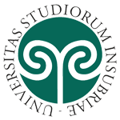

# Practical Quantum Computing 2022

The course consists of lectures and practical assignments.

On each day the first part is lecture, the second is for practical laboratory.

To increase interactivity and to allow continuous support for the entire semester, please use the following Discord channel:
https://discord.gg/GDmE8a8E

Active participation in the Discord channel is strongly encouraged.

## Preliminary Schedule (Click <a href="https://teams.microsoft.com/l/meetup-join/19%3aJHjfkOTzbbuu5mIezsD93gyg8y8PtFLcDDmUL63yl981%40thread.tacv2/1642538845352?context=%7b%22Tid%22%3a%229252ed8b-dffc-401c-86ca-6237da9991fa%22%2c%22Oid%22%3a%22f7d485f6-ad05-453f-ac66-c957b799ca50%22%7d" target=_blank>here</a> to join the lectures)
* 1 March, 15 - 18 CET
* 2 March, 15 - 18 CET
* 7 March, 15 - 18 CET
* 8 March, 15 - 18 CET
* 9 March, 15 - 18 CET
* 15 March, 15 - 18 CET
* 21 March, 15 - 18 CET
* 22 March, 15 - 18 CET
* 29 March, 15 - 18 CET
* 5 April, 15 - 18 CET
