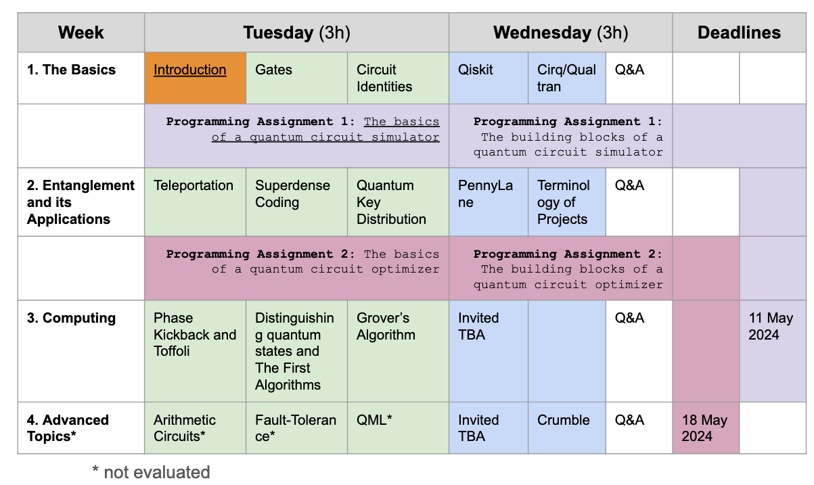

# PQC 2024 period 5

The course was organized into two parts:
1. lectures accompanied by two programming assignments (Progr. Assign. 1 &2, see below)
2. time for a larger project (Project) that is building on the experience gathered with the previous two projects

## Grading

The total number of achievable points: 100 points
* Quiz (timed on MyCourses, with tutorial questions, at the end of last week) - 20 points
* Progr. Assign. 1 -- Quantum Circuit Simulator - 10 Points
* Progr. Assign. 2 -- Quantum Circuit Optimizer - 20 Points
* Project -- see the list linked below which is solved individually or in a team of two - 50 Points
* Final feedback - 5 Points (bonus: adds towards the maximum)

The minimum number to pass: 20 points

| Grade | Points |
| ---   | ---    |
| 0 	| 0-19   |
| 1 	| 20-30  |
| 2 	| 31-40  |
| 3 	| 41-50  |
| 4 	| 51-75  |
| 5 	| 76-100 |